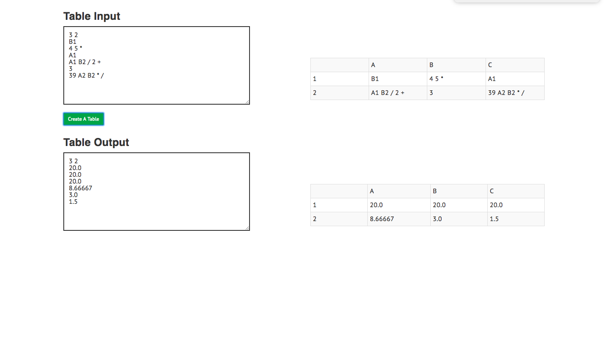

# README

### Overview

A simple "spreadsheet calculator" built on React, Ruby on Rails, and PostgreSQL.

### Get Started

1. Install dependencies by running `npm install` followed by `bundle install`
2. PostgreSQL was my db of choice. Start your database by running `bundle exec rake db:setup`.
3. Start your server by running `bundle exec rails server` and opening `localhost:3000` in your browser.
4. Start webpack by running `webpack --watch`
5. Run tests with `bundle exec rspec spec`. (please not some specs are not working properly; see issues portion below)

### Technologies

1. The spreadsheet calculator is built on React and Rails. I decided to use vanilla React to see what issues would arise without the benefit of Redux's universal store to hold state. Additional front-end dependencies include babel, and react-bootstrap. 

The backend utilizes Rails - per requirement. The gems used include: `better_errors`, `binding_of_caller`, `should-matchers`, and `annotate`. PostgreSQL was used because it made sense to use a relational database.

### Architecture

#### Back-end
The schema consists of two tables, `Table` and `Cell`. `Cells` belong to a `Table`, and a `Table` has many `Cells`. A `Table` keeps track of its size, ie. 3x2 table would be `size: "3 2"`. A Cell keeps track of its value as a string because of potential expressions. An input column holds a boolean to determine whether the cell is an input from the user, or an output generated by the script.

#### Front-end

The spreadsheet is made of three components, Tables (parent), Forms (child), Grids (child). In retrospect, these could've been better names because of bootstrap's naming conventions, but we're literally working with Tables, Forms, and Spreadsheets. Tables holds the state  passing them down to its children as props. Forms only deals with taking the user input and posting it to the back-end. The event-listener functions on the forms are in the Table's component, and passed as props. The same goes for the Grid component.

### Dev-Related Issues

#### Things I learned

1. When working in React, returning an array of html elements is just fine and renders properly.
2. Running a third-party script within my controller and catching an error - if any.

#### Questions I came across when building this app:

Back-end Architecture

I was unsure if I wanted to:
1. store coordinates in the backend as in `[0][0]` for the first value, `[0][1]` for the second value, etc. In retrospect, having coordinates might've helped me in the front-end when making the actual table.
2. store "rows/columns" as in table schema rather than a "size". Reason being, storing size means I would have to parse the string "3 2", to later work with the numbers whereas I wouldn't have to if I just kept them separate. Semantically, it arguably makes more sense as well. On the flip-side however, it's not very taxing on the browser considering it's just a few lines of code.
3. prevent posting/creating the exact same table. If I wanted to, I believe I would need to store both the input as a string, I.e. "3 2↵B2↵4 3 *↵C2↵A1 B1 / 2 +↵13↵B1 A2 / 2 *", thereby allowing me utilize a uniqueness validation. I would then just fetch the existing table rather than generating a new one.

Front-end Architecture

Things I would've done differently:
1. Each cell would be its own component. However, the way I'm currently sending up and storing data about the cells doesn't make it feasible.
2. The methods I used to generate a table seems way too convoluted - there has to be a better way.

#### Issues

I kept getting these No Template errors when trying to run my controller tests. I assumed it had something to do with my jbuilder file because my controllers worked perfectly fine when I was serving up html and using `show.html.erb`. I re-added my `show.html.erb` and the tests ran perfectly. However, the application wouldn't work afterwards, and when I checked to see what was being served back to my front-end, I received HTML. Therefore, for the sake of functionality, I deleted the `show.html.erb` file, but feel free to re-add it to run the tests.